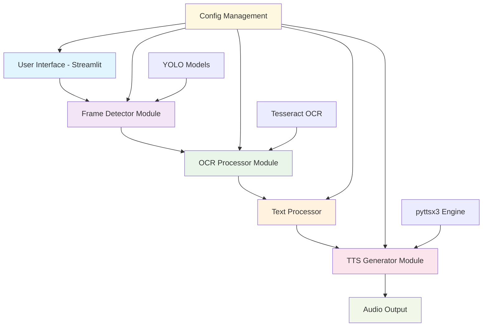
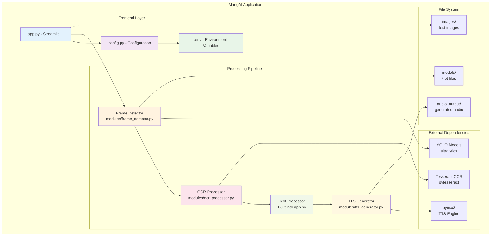
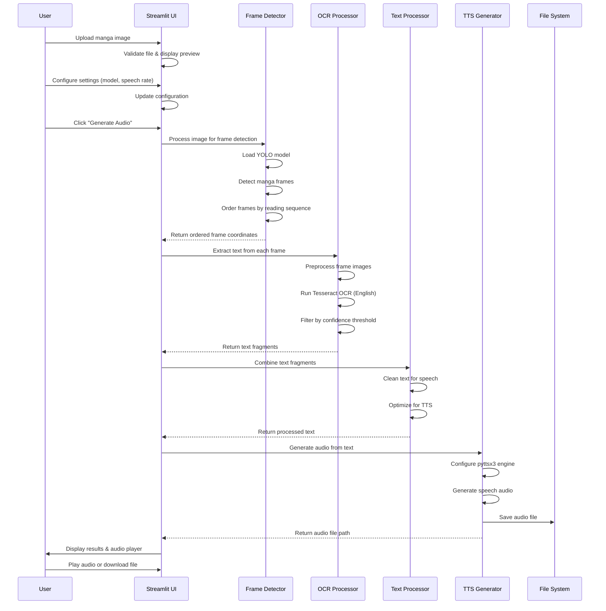
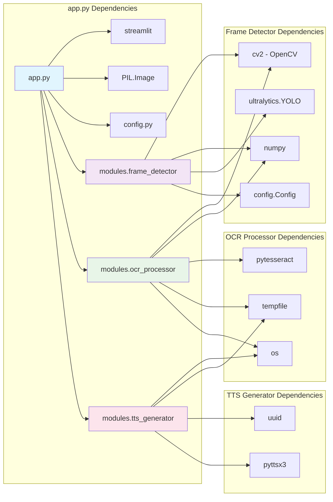
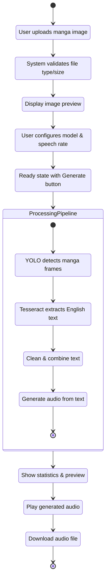
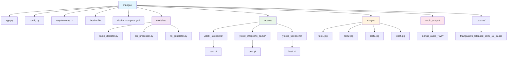
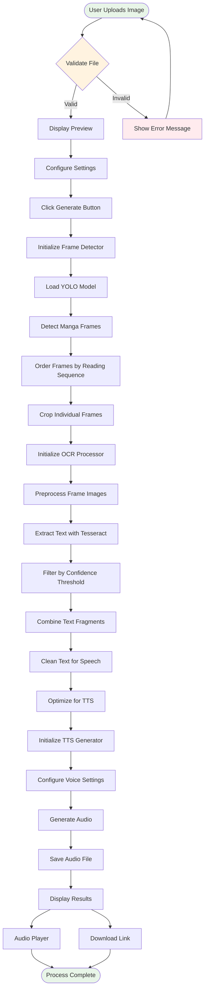

# MangAI Architecture Diagrams

This document contains comprehensive Mermaid diagrams showing the architecture and data flow of the MangAI application.

## 1. High-Level System Architecture

## 2. Detailed Component Interaction

## 3. Data Flow Sequence

## 4. Module Dependencies

## 5. User Interaction Flow

## 6. File System Organization

## 7. Processing Pipeline Detail

## Key Features Highlighted

- **🔄 Modular Architecture**: Each processing step is isolated in its own module
- **📊 Sequential Pipeline**: Clear data flow from image to audio
- **⚙️ Configuration Management**: Centralized settings and environment variables
- **🎯 English-Only Focus**: Simplified processing for English manga
- **🐳 Docker Support**: Containerized deployment option
- **📝 Error Handling**: Validation at each processing step
- **🎵 Audio Generation**: Local TTS without external API dependencies

## Migration Notes

The original `yolov8Model.py` functionality has been successfully integrated into the modular architecture while maintaining backward compatibility and adding enhanced features for better maintainability.
